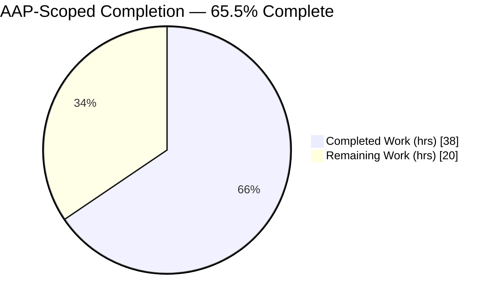
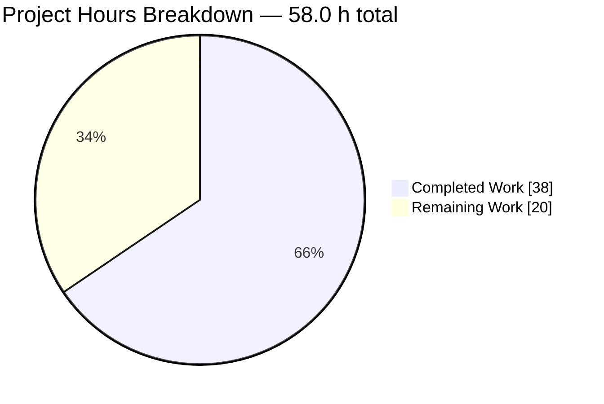
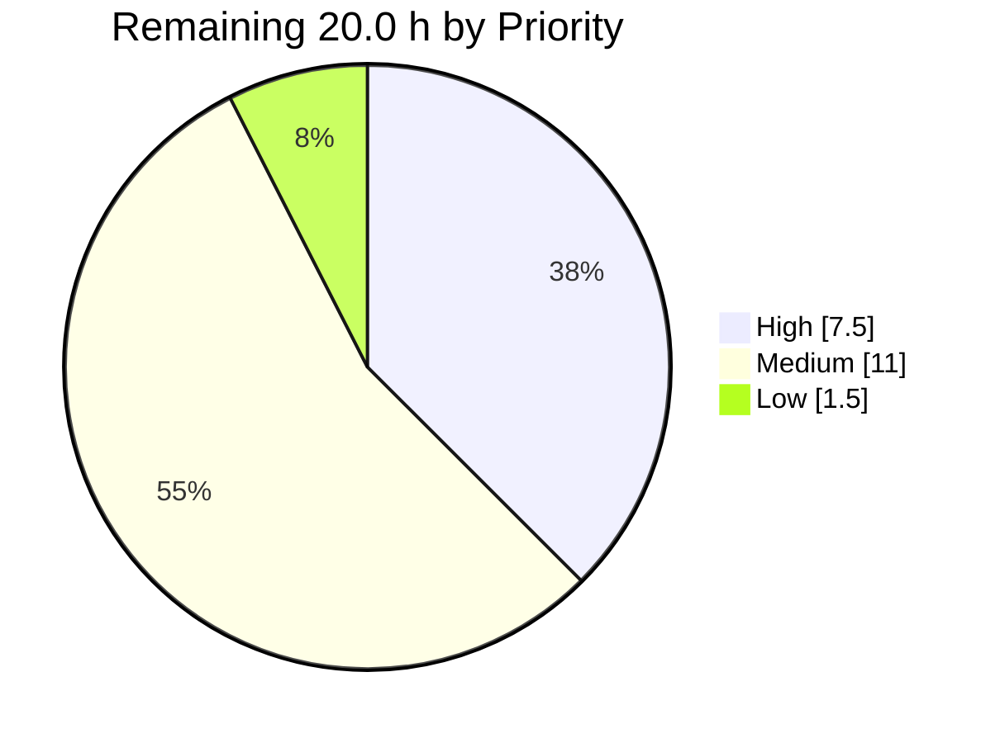
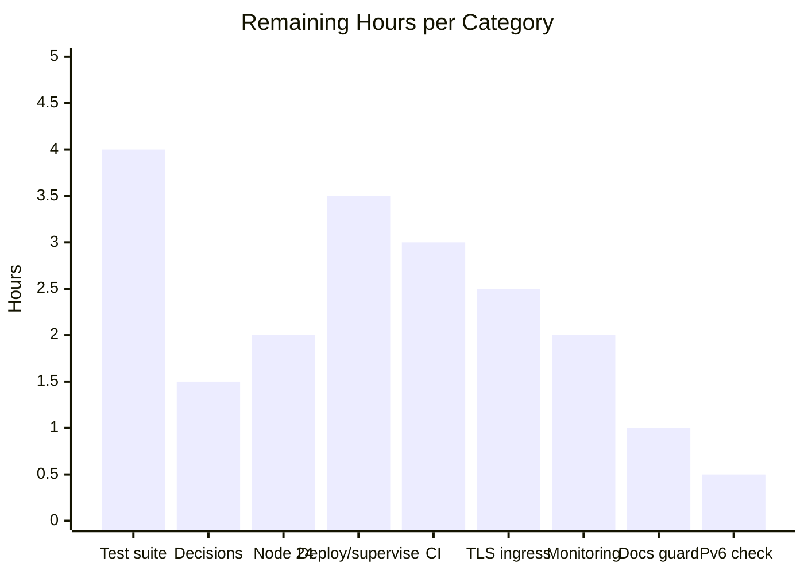
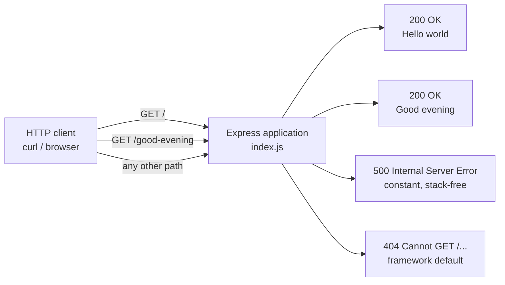

# 1. Executive Summary

## 1.1 Project Overview

Artifact-8 is a minimal Node.js tutorial HTTP server. This work bootstrapped the Node project the tutorial assumes, introduced the Express framework, and exposed two endpoints from one application file: `GET /` returning `Hello world` and `GET /good-evening` returning `Good evening`. The audience is a developer following the tutorial locally, so the scope is small by design — one dependency (`express` 5.2.1), one entry point, a committed lockfile for reproducible installs, and a README covering install, run, verify and stop. The result is a runnable, documented reference project where only a title existed before.

## 1.2 Completion Status



Colours: Completed = Dark Blue `#5B39F3`, Remaining = White `#FFFFFF`.

| Metric | Value |
| --- | --- |
| Total Hours | 58.0 |
| Completed Hours (AI + Manual) | 38.0 (38.0 AI + 0.0 Manual) |
| Remaining Hours | 20.0 |
| Percent Complete | **65.5%** |

Calculation: 38.0 ÷ (38.0 + 20.0) = **65.5%**.

## 1.3 Key Accomplishments

- ✅ `GET /` returns exactly `Hello world` — 11 bytes, verified as bytes and in a browser.
- ✅ `GET /good-evening` returns exactly `Good evening` — 12 bytes, the endpoint requested.
- ✅ Express 5.2.1 declared and locked; installs deterministically (68 packages, 0 advisories).
- ✅ Runs with `npm install` then `npm start`; the startup line names the address bound.
- ✅ An unusable `PORT` exits 1 instead of pretending to serve.
- ✅ A failed request returns a constant `500` with no stack trace or path.
- ✅ The listener binds loopback by default; `HOST` widens it deliberately.
- ✅ README covers prerequisites, install, run, exposure, stop/restart and both endpoints.

## 1.4 Critical Unresolved Issues

All three requested requirements — add Express, preserve `Hello world`, add `Good evening` — are delivered and verified: **0 of 3 are open**. **5 open items** remain, each a quality or operations item; none changes what either endpoint returns.

| Issue | Impact | Owner | ETA |
| --- | --- | --- | --- |
| No automated regression coverage: 0 test files, no `test` script, so six critical paths have no executable failure signal | A future edit can change a response byte, the start script, the dependency, port handling or the listener with nothing failing | Project owner + backend dev | 4.0 h after scope approval |
| `engines.node` is `">=18"`, which also admits Node lines that are now end of life | Advisory only (npm warns, it does not block); an operator may install on an unmaintained runtime | Project owner | 1.5 h (decision) |
| Whitespace-only `PORT` binds an OS-assigned port instead of failing | A nonsense value yields a working server on an unpredictable port; the startup line does name it | Backend dev | 0.5 h (bundled with the decision above) |
| Node 24.x is the recommended runtime, but execution evidence exists only for Node 22.23.2 | No proof of behaviour on the runtime the README recommends first | Backend dev | 2.0 h |
| The IPv6 branch of the startup-line formatter was never executed end to end (no IPv6 loopback address on the build host) | A dual-stack host takes a code path proven only by expression evaluation | Backend dev | 0.5 h |

## 1.5 Access Issues

**No access issues identified.** The public npm registry is reachable (`npm ping` → PONG; `npm ci` → exit 0, 68 packages) and needs no authentication. There is no `.npmrc`, and the project needs no secrets, tokens or service endpoints. Git operations are local and the branch tip matches its remote counterpart.

## 1.6 Recommended Next Steps

1. **[High]** Approve and add a regression suite plus a declared `test` script over the six critical paths (4.0 h).
2. **[High]** Record the three open decisions: supported Node range, test scope, whitespace-only `PORT` (1.5 h).
3. **[High]** Validate install, start and both endpoints once on Node 24 Active LTS (2.0 h).
4. **[Medium]** Supervise `node index.js` directly, with `PORT`/`HOST`/`NODE_ENV` wired and a restart policy (3.5 h).
5. **[Medium]** Add CI that installs, syntax-checks, runs the suite and smoke-tests both endpoints (3.0 h).

# 2. Project Hours Breakdown

## 2.1 Completed Work Detail

| Component | Hours | Description |
| --- | --- | --- |
| Project manifest & Express dependency (FR-1) | 2.0 | `package.json` with `express ^5.2.1`, `start` script, `main`, `engines`, CommonJS preserved (no `type` field) |
| Deterministic lockfile (FR-1) | 1.0 | `package-lock.json` (v3, 69 entries) committed; express pinned 5.2.1 with integrity metadata |
| Express application entry point & listener (FR-1) | 2.5 | `index.js` — single `require('express')`, one app, port resolution, one `app.listen`, startup line |
| `GET /` → `Hello world` (FR-2) | 1.0 | Original tutorial response preserved and served through Express (`index.js:19`) |
| `GET /good-evening` → `Good evening` (FR-3) | 1.0 | Added endpoint (`index.js:21`) |
| Repository hygiene | 0.5 | `.gitignore` excluding `node_modules/`, `npm-debug.log*`, `.env`, with the lockfile kept tracked |
| Usage documentation (core) | 3.0 | README overview, prerequisites, install, run, endpoint table, verify block; `# Artifact-8` title preserved |
| Plan validation approach | 2.0 | Install → start → `curl` both routes for status 200 and exact bodies |
| Startup-failure reporting & port robustness | 3.5 | Error-first listen callback (EADDRINUSE → exit 1, no false success), numeric port resolution, banner reporting the address actually bound |
| Response-header hardening | 1.5 | `app.disable('x-powered-by')` and `X-Content-Type-Options: nosniff` on both responses |
| Error containment | 3.0 | Four-argument error middleware: constant stack-free `500`, `text/plain` + `nosniff` + CSP, delegation once headers are sent |
| Network-exposure control | 2.0 | `HOST` resolution with a `127.0.0.1` default; wildcard and IPv6 handling in the startup line |
| Fatal-fault traps | 2.0 | `uncaughtException` / `unhandledRejection` report, close the listener and exit non-zero, with an unreferenced backstop timer |
| Operational documentation | 3.0 | README network exposure, production runs (`NODE_ENV`), and stop/restart with the npm-wrapper caveat and recovery |
| Verification & validation sweep | 10.0 | HTTP contract, route surface and method spectrum, caching, configuration matrix, concurrency and stability, security probes, dependency advisory review, browser checks |
| **Total** | **38.0** | Matches Completed Hours in Section 1.2 |

## 2.2 Remaining Work Detail

| Category | Hours | Priority |
| --- | --- | --- |
| Automated regression suite + declared `test` script over the six critical paths | 4.0 | High |
| Outstanding decisions: supported Node range, test-scope expansion, whitespace-only `PORT` behaviour | 1.5 | High |
| Node 24 Active LTS validation and `engines`/README alignment | 2.0 | High |
| Deployment & process supervision (supervise `node index.js`, wire `PORT`/`HOST`/`NODE_ENV`, restart policy) | 3.5 | Medium |
| CI pipeline (install, syntax gate, suite, endpoint smoke test) | 3.0 | Medium |
| TLS / reverse-proxy ingress and exposure decision | 2.5 | Medium |
| Health endpoint and operational monitoring | 2.0 | Medium |
| Documentation drift guard in CI | 1.0 | Low |
| IPv6 dual-stack startup-banner verification | 0.5 | Low |
| **Total** | **20.0** | Matches Remaining Hours in Sections 1.2 and 7 |

## 2.3 Basis of Estimate

Hours are bottom-up per deliverable and cover only work the plan scoped plus the standard path-to-production activities needed to deploy it. Build effort accounts for 28.0 of the 38.0 completed hours and verification for the remaining 10.0 — about 36% of build effort, in line with a project whose entire acceptance criterion is byte-exact response fidelity. Confidence is **high** on every completed row, because each maps to code in the repository and to checks that were executed against a running server. Confidence is **high** on the three High-priority remaining rows (the suite was scoped and costed in detail, the decisions are bounded, and the Node 24 run is a repeat of checks already scripted) and **medium** on the deployment, ingress and monitoring rows, whose effort depends on the target platform the owner chooses. Total Project Hours = 38.0 + 20.0 = 58.0.

# 3. Test Results

The project declares no test framework and no `test` script, so there is no suite to run: `npm test` exits 1 with `Missing script: "test"`. The results below are from an executed verification gate — a scripted set of assertions driven against the built tree and a live listener on Node v22.23.2, with `curl`, `ss`, `lsof` and `xxd` as the observers. Every number is an observed outcome, and no coverage tooling exists in the project, so no coverage figure is claimed.

| Area / Category | Framework | Tests | Passed | Failed | Coverage | What This Proves |
| --- | --- | --- | --- | --- | --- | --- |
| Static & build integrity | `node --check`, `npm ci`, `npm ls`, JSON parse, git checks | 22 | 22 | 0 | n/a | The tree installs deterministically to express 5.2.1 and the entry point and both manifests are valid |
| Endpoint contract (FR-2, FR-3) | curl + `xxd` byte comparison | 12 | 12 | 0 | n/a | Both endpoints return status 200 and their exact bodies, repeatably and with no trailing character |
| Response headers & hardening | curl header inspection | 8 | 8 | 0 | n/a | `nosniff` is sent on both responses, no framework banner leaks, and conditional requests revalidate to 304 |
| Route surface, methods & hostile input | curl matrix | 18 | 18 | 0 | n/a | Only the documented spellings answer; other verbs and paths get the framework 404, and query payloads are never reflected |
| Runtime start-up, concurrency & log hygiene | detached process + `ss` + parallel curl | 8 | 8 | 0 | n/a | The server starts once, serves 30 concurrent requests correctly, logs one line and releases its port on stop |
| `PORT` / `HOST` configuration matrix | child-process runs + `ss` | 25 | 25 | 0 | n/a | Default, empty, override and OS-assigned ports all work; unusable values and an occupied port fail fast with exit 1 |
| Install → run → stop → restart lifecycle | `npm ci`, `npm start`, `lsof`-directed stop | 8 | 8 | 0 | n/a | The documented workflow works end to end, and a restart serves both endpoints again |
| Error containment & fatal-fault traps | fault-injecting harness (entry point verbatim + two throwing routes) | 29 | 29 | 0 | n/a | A failed request returns a constant stack-free 500 in every environment, and out-of-band faults exit non-zero and free the port |
| **Total** | — | **130** | **130** | **0** | n/a | — |

**Not Covered**

- **Everything above is unguarded by any committed test.** The repository contains 0 test files, 0 test cases and no `test` script, so none of these 130 checks will run again automatically. Six critical paths carry no executable failure signal: dependency and import resolution, `npm start` entry-point selection, the two route contracts, the `PORT` default/override branches, and listener bootstrap. A human should add the suite before the next change to `index.js` or `package.json`.
- **The `engines.node` range is not enforced anywhere.** Its rejection of older Node lines was reasoned about, not executed; npm only surfaces a mismatch as an install-time warning. Test it by installing on a non-conforming runtime if the range matters to you.
- **Node 24.x, the runtime the README recommends first, was never executed.** All results above are from Node 22.23.2.
- **The IPv6 branch of the startup-line formatter never ran** — the build host has no IPv6 loopback address, so `HOST=::1` fails closed there. Verify it once on a dual-stack host.
- **README prose has no automated guard.** Its claims about headers, ports, route spellings and stop recipes were each checked against the running server by hand, but nothing will fail if the code later drifts from the text.

# 4. Runtime Validation &amp; UI Verification

Every line below was observed against a running instance of the delivered code, driven with `curl` and, where a client's view mattered, with a real headless Chrome session.

- ✅ **Start-up** — `npm start` resolves to `node index.js` and logs `Server listening on http://127.0.0.1:<port>`. Confirmed on the default port 3000, on an explicit override and on an OS-assigned port; the printed address always matched what the socket table reported.
- ✅ **`GET /`** — 200 with body exactly `Hello world` (11 bytes, hex `48656c6c6f20776f726c64`). Chrome rendered exactly `Hello world`, 11 characters.
- ✅ **`GET /good-evening`** — 200 with body exactly `Good evening` (12 bytes, hex `476f6f64206576656e696e67`). Chrome rendered exactly `Good evening`, 12 characters.
- ✅ **Response posture** — both responses carry `Content-Type: text/html; charset=utf-8` and `X-Content-Type-Options: nosniff`, with no `X-Powered-By` and no `Server` banner; a conditional request with the current `ETag` returns 304.
- ✅ **Unmatched routes** — the framework 404 answers `Cannot GET /no-such-route` with `nosniff` and `Content-Security-Policy: default-src 'none'`. Chrome confirmed no stack trace, filesystem path or framework-version disclosure in the page.
- ✅ **Error path** — provoked synchronous and asynchronous failures return `500` with the body exactly `Internal Server Error`, with `NODE_ENV` unset and again under `NODE_ENV=production`; zero stack, path or markup content in the response, and the stack retained only in the server log.
- ✅ **Fatal faults** — an out-of-band throw and an out-of-band promise rejection each log their label, exit with status 1 and release the port for a restart.
- ✅ **Port configuration** — unset and empty fall back to 3000; `PORT=0` binds an OS-assigned port and reports it truthfully; `abc`, `-1`, `99999`, `65536` and `3011.5` each exit 1 with `ERR_SOCKET_BAD_PORT` and no listener; an occupied port reports `EADDRINUSE` and exits 1 with no false success line.
- ✅ **Network exposure and lifecycle** — the socket table shows `127.0.0.1:<port>`, `HOST=0.0.0.0` widens the bind and prints a usable URL, and each documented stop recipe ended the listener with the port free and a restart serving both endpoints.
- ⚠ **Not exercised at runtime** — the IPv6 branch of the startup-line formatter (no IPv6 loopback address on the build host) and Node 24.x. There are no external integrations, no database, no authentication and no user interface beyond the two text responses, so nothing else remained to drive: the only browser-side diagnostics were one expected `/favicon.ico` 404 per page load and a Quirks-Mode notice, both inherent to serving a constant string with no document markup.

# 5. Compliance &amp; Quality Review

## 5.1 Compliance Matrix

Status is the verified state of each deliverable as it stands in the repository today.

| Deliverable | Benchmark | Status | Evidence |
| --- | --- | --- | --- |
| FR-1 — Express integrated | Declared, locked, resolvable, single framework | ✅ Pass (100%) | `package.json:11` `express ^5.2.1`; lock v3 pins 5.2.1; `npm ci` → 68 packages; `require('express/package.json').version` → 5.2.1 |
| FR-2 — `Hello world` preserved | Byte-exact body, status 200, served via Express | ✅ Pass (100%) | `index.js:19-20`; 11-byte body verified by hex comparison and in Chrome |
| FR-3 — `Good evening` added | Byte-exact body, status 200 | ✅ Pass (100%) | `index.js:21-22`; 12-byte body verified the same way |
| Single entry point, CommonJS | One `require`, one app, one listener, no ESM | ✅ Pass (100%) | `index.js` — 1 `require`, 2 routes, 1 `app.listen`, no `type` field in the manifest |
| Runnable and documented | `npm install` → `npm start` works as written | ✅ Pass (100%) | `scripts.start` = `node index.js`; workflow executed from a cleared `node_modules` |
| Reproducible installs | Lockfile committed, integrity intact | ✅ Pass (100%) | `package-lock.json` tracked, 69 entries, `npm ls --all` exit 0, `npm outdated` clean |
| Repository hygiene | Generated tree excluded, deliverables tracked | ✅ Pass (100%) | `.gitignore` (3 patterns); exactly 5 tracked files; clean working tree |
| Documentation accuracy | Every claim true against the code and runtime | ✅ Pass (100%) | README media type, route spellings, port behaviour and stop recipes each reproduced against a live server |
| Error handling & disclosure | No stack, path or framework disclosure to clients | ✅ Pass (100%) | Constant `500 Internal Server Error`; `X-Powered-By` absent on 200s and 404s |
| Dependency security | No known advisories in the locked graph | ✅ Pass (100%) | `npm audit --package-lock-only` → 0 vulnerabilities across 69 entries |
| Supported-runtime declaration | Range should admit only maintained runtimes | ⚠ Partial (50%) | `package.json:13-15` `engines.node ">=18"` — the plan's literal value, which also admits end-of-life Node lines |
| Automated regression coverage | Critical paths guarded by an executable suite | ❌ Not met (0%) | 0 test files, 0 test cases, no `test` script; `npm test` exits 1 |

## 5.2 AAP &amp; Rule Divergences and Gaps

No user-specified rules exist for this project, so the plan is the only agreed contract; the divergences below are all against it. Two of them (rows 5 and 6) are release-relevant and appear in Section 1.4; rows 5, 6, 7 and 8 have tasks in Section 2.2.

| # | What the AAP/Rule Required | What Was Delivered Instead | Why It Diverged | Impact | Remediation |
| --- | --- | --- | --- | --- | --- |
| 1 | Port resolved as `process.env.PORT \|\| 3000`, with no coercion | `Number(process.env.PORT \|\| 3000)` (`index.js:10`) | Node treats a string it cannot read as a port as a pipe name, so the plan's expression would start a filesystem-socket listener on a typo'd port and still report success | None for documented inputs; malformed values now fail fast | None required |
| 2 | A roughly dozen-line entry file with inline handlers and no middleware | 111-line `index.js` adding fingerprint suppression, per-response `nosniff`, an error middleware and two fatal-fault traps | Framework-default error rendering returns stack traces when `NODE_ENV` is unset, and an out-of-band fault reaches no handler at all | Larger tutorial file; behaviour strictly safer; both bodies unchanged | Owner decision if brevity is preferred over the hardening |
| 3 | `app.listen(PORT, ...)` — port only | `app.listen(PORT, HOST, cb)` with `HOST` defaulting to `127.0.0.1` (`index.js:58-73`) | A port-only `listen` binds every interface, which publishes both endpoints on every network the host is attached to | Not reachable from other machines unless `HOST` is set | Set `HOST=0.0.0.0` where non-local access is wanted |
| 4 | README limited to overview, prerequisites, install/run and an endpoint table | 135-line README adding *Network exposure*, *Production runs* and *Stopping and restarting* | Each documents behaviour of the delivered code that the plan's four sections do not cover | Longer document; every claim verified against the running server | None required |
| 5 | `engines.node` set to the literal `">=18"` | `">=18"` as specified, carrying a known caveat (`package.json:13-15`) | The frozen plan fixes this value in five places, and support-window advice does not override it | The manifest advertises Node lines that are end of life; advisory only, and the locked graph reports no vulnerabilities | Ratify the range, or amend the plan and narrow manifest, lock and README together |
| 6 | Automated tests explicitly out of scope | No tests delivered, and the owner scope decision remains unmade | Sanctioned exclusion; expanding scope is not an implementation decision | Six critical paths have no executable failure signal | Authorise the suite and add it (4.0 h, no new dependencies) |
| 7 | Node 24.x Active LTS as the target runtime | Built, run and verified on Node 22.23.2 | 22.23.2 is the runtime installed on the build host; it satisfies the declared `>=18` floor | No execution evidence on the runtime the README recommends first | Repeat the install/start/endpoint checks once on Node 24 |
| 8 | Nothing in the plan covers a whitespace-only `PORT` | `PORT="  "` binds an OS-assigned port instead of failing | `Number("  ")` is `0`, and rejecting it needs the validation the plan forbids | A nonsense value produces a working server on an unpredictable port | Document the behaviour or amend the plan to permit validation |

**1 — Port coercion.** The plan writes the port expression as a bare `||` fallback and explicitly rules out coercion. Delivered code wraps that same fallback in `Number()` at `index.js:10`, and nothing else about the expression changed. The reason is behavioural: Node's `listen` classifies a string whose numeric value is unusable as an IPC path, so under the plan's literal expression `PORT=8O80` binds a socket file in the working directory, logs a successful start and answers nothing over TCP. With the coercion, every input the plan documents behaves identically — unset and empty give 3000, a numeric override binds, `PORT=0` asks the operating system — and unusable values exit 1 with `ERR_SOCKET_BAD_PORT`. No human action is needed unless the literal expression must be restored, which reinstates that silent-failure mode.

**2 — Entry-point size and middleware.** The plan asked for tutorial-grade minimalism: inline handlers, no middleware, roughly a dozen lines. The delivered `index.js` is 111 lines, about half of it explanatory comment, and it registers `app.disable('x-powered-by')`, sets `nosniff` on both responses, adds a four-argument error middleware (`index.js:34-56`) and traps `uncaughtException` and `unhandledRejection` (`index.js:110-111`). Each addition closes a concrete exposure: the framework's own final handler writes `err.stack` into the response body whenever `NODE_ENV` is unset, and without the traps an out-of-band fault would leave a process serving traffic after it had lost its invariants. Both response bodies are byte-identical to the plan's, no dependency was added, and no router, controller or service module was introduced. Whether the tutorial should trade brevity for that hardening is an owner call.

**3 — Listener bind host.** The plan specifies only a port, and a port-only `listen` binds every interface, so both endpoints would answer on every network the host is attached to. Delivered code resolves `HOST` with a `127.0.0.1` default and passes it to `app.listen` (`index.js:58-73`), so the default answers only the local machine; the socket table confirms `127.0.0.1:<port>` rather than a wildcard. `HOST=0.0.0.0` restores the wider bind deliberately and prints a usable URL. The plan's own verification commands still pass, because `localhost` reaches the IPv4 loopback bind. Anyone running this in a container and opening it from the host must set `HOST=0.0.0.0`, which the README documents under *Network exposure*.

**4 — README scope.** The plan scoped the README to an overview, prerequisites, install and run commands, and an endpoint table. The delivered file is 135 lines and adds three subsections, because the delivered behaviour needs them: *Network exposure* explains the loopback default and the `HOST` override, *Production runs* explains why `NODE_ENV=production` matters to a framework that decides its error rendering from it, and *Stopping and restarting* documents the three stop mechanisms that reach the listener plus the recovery from an orphaned one. The `# Artifact-8` title, the two-row endpoint table and both response literals are preserved. Every added command and claim was executed against a running server; nothing is aspirational.

**5 — Supported-runtime range.** `package.json:13-15` declares `engines.node ">=18"`, exactly as the plan fixes it in five separate places. The caveat that comes with it is that an open-ended floor also admits Node 18, 19, 20, 21, 23 and 25, none of which receive security updates today. A narrower range covering only the maintained LTS lines was not adopted, because the frozen plan outranks support-window advice and no exception to it is on record. The practical exposure is limited: `engines` is advisory metadata that npm surfaces as a warning rather than a gate, the locked dependency graph reports no vulnerabilities, and the README recommends Node 24.x first. The owner should either ratify `">=18"` or amend the plan and narrow the manifest, lockfile mirror and README together.

**6 — Automated tests.** The plan places automated tests and test frameworks explicitly out of scope, so delivering none is compliant — but it leaves the repository with 0 test files and no `test` script, and `npm test` exits 1 with `Missing script: "test"`. The scope decision that would change this belongs to the owner and has not been made, which is why it appears here as an open item. The consequence is concrete: dependency resolution, entry-point selection, both route contracts, the port branches and listener bootstrap can all break with no automated signal. The work is small and costed — Node's built-in test runner with `node:assert/strict` and `fetch`, no new dependencies, plus `module.exports = app` and a `require.main` guard in `index.js` (Section 2.2, 4.0 h).

**7 — Target runtime.** The plan names Node 24.x Active LTS as the target and sets the engine floor to match the framework's own minimum. Everything delivered was built, installed, started and verified on Node 22.23.2, the runtime present on the build host, which satisfies both the declared `>=18` floor and the framework's own `>= 18`. Nothing in the code is version-sensitive — one dependency, no native bindings, no experimental APIs — so the risk is low, but this guide will not claim what was not run. A single pass of `npm ci`, `node --check`, a start and both endpoint checks on Node 24 closes it (Section 2.2, 2.0 h), after which the README recommendation and the engine range can be reconciled with observed behaviour.

**8 — Whitespace-only `PORT`.** No plan requirement covers this input, and it behaves surprisingly: `PORT="  "` starts a working server on an OS-assigned port, because `Number("  ")` is `0` and zero means "any free port" to the operating system. It was observed directly — the startup line named `http://127.0.0.1:46103` — so the behaviour is at least discoverable from the log rather than silent. Making that one value fail would require the range validation the plan rules out, so it is documented here rather than changed in code. The owner should choose between accepting the behaviour as documented and amending the plan to permit validation; that choice sits in the 1.5 h decision task in Section 2.2.

# 6. Risk Assessment

These are forward-looking exposures in the delivered state. The deliverable has no database, queue, third-party service or credential, so integration risk is confined to how the process is launched and stopped.

| Risk | Category | Severity | Probability | Mitigation | Status |
| --- | --- | --- | --- | --- | --- |
| No automated regression coverage — a change to a response byte, the start script, the dependency, port handling or the listener ships without any failing signal | Technical | High | High | Add the costed suite and a declared `test` script (Section 2.2); until then treat every edit to `index.js` or `package.json` as requiring manual re-verification with Section 9's commands | Open |
| `engines.node ">=18"` advertises Node lines that no longer receive security updates | Security | Medium | Medium | Pin the runtime in whatever image or supervisor runs the app; ratify or narrow the declared range | Accepted with caveat |
| Plain HTTP with no transport security — anything served beyond loopback travels in clear text | Security | Medium | Medium | Terminate TLS at a reverse proxy and keep the app bound to `127.0.0.1` behind it | Open |
| No authentication, authorisation or rate limiting; setting `HOST=0.0.0.0` publishes both endpoints on every attached network | Security | Low | Low | Keep the loopback default; widen only behind a proxy that owns access control. Both responses are constant strings that hold no data and reflect no input, which bounds the exposure | Accepted (out of plan scope) |
| Signalling the `npm` wrapper by PID leaves the listener orphaned on PID 1 still holding the port, so the next start fails with `EADDRINUSE` | Integration | Medium | Medium | Supervise `node index.js` directly, or use the process-group or listener-directed stop; both are documented in README *Stopping and restarting* | Documented, mitigation available |
| No health endpoint, metrics or log destination — an orchestrator has nothing to probe and a fault is visible only in the process's own output | Operational | Medium | Medium | Add a health route plus an uptime check and log shipping (Section 2.2) | Open |
| Whitespace-only `PORT` silently binds an OS-assigned port instead of failing | Technical | Low | Low | Document the behaviour or permit range validation; the startup line does report the port actually bound | Open decision |
| Documentation drift — the README makes precise claims about headers, ports, route spellings and stop recipes with no linter or docs test guarding them | Operational | Low | Medium | Add a documentation check to the CI pipeline (Section 2.2) | Open |

# 7. Visual Project Status

**Overall progress (hours).** Completed = Dark Blue `#5B39F3`; Remaining = White `#FFFFFF`.



**Remaining work by priority (hours).**



**Remaining work by category (hours).**



**Delivered scope at a glance.** All three functional requirements are complete and verified; the outstanding work is the path to production.



# 8. Summary &amp; Recommendations

**What was delivered.** The repository went from a one-line README to a runnable Express project: a manifest declaring `express ^5.2.1`, a committed lockfile pinning the resolved 5.2.1 tree, a single CommonJS entry point serving `GET /` → `Hello world` and `GET /good-evening` → `Good evening`, a three-pattern `.gitignore`, and a README that documents prerequisites, install, run, network exposure, production runs, stop/restart and both endpoints. Five files are tracked, exactly the five the plan named. On the hours in Section 1.2, the project stands at **65.5% complete** — 38.0 of 58.0 hours — with every hour of the remainder in path-to-production work rather than in the feature itself.

**What was verified.** Both endpoints were exercised as bytes, not as prose: 11 and 12 bytes, hex-compared, then confirmed again in a real browser with the rendered text measured character by character. Around them, a 130-check gate covering static and install integrity, the header posture, the route and method surface, hostile query input, the `PORT`/`HOST` configuration matrix, the install→run→stop→restart lifecycle, error containment and both fatal-fault traps ran with 130 passes and no failures. A failed request returns a constant `500` with no stack or path in the body, with `NODE_ENV` unset and under production alike; an unusable `PORT` exits 1 rather than pretending to serve; an occupied port reports `EADDRINUSE` instead of logging a false success. The locked dependency graph reports no known advisories.

**What is still open.** Five items, none of which changes what either endpoint returns. The largest by far is that none of the verification above is guarded by a committed test: the repository has no test files and no `test` script, so six critical paths — dependency resolution, entry-point selection, both route contracts, the port branches and listener bootstrap — carry no executable failure signal. Alongside it sit three decisions the owner must record (the supported Node range, the test-scope expansion, and whether a whitespace-only `PORT` should fail), a runtime gap (the README recommends Node 24.x, while all execution evidence is from Node 22.23.2), and one code path never executed end to end (the IPv6 branch of the startup line).

**Critical path to production.** In order: authorise and add the regression suite (4.0 h), record the three decisions (1.5 h), and validate once on Node 24 (2.0 h) — 7.5 hours that convert this from a verified-by-hand deliverable into one with a repeatable gate. Then the operational layer the plan deliberately excluded: supervise `node index.js` directly rather than through `npm` (3.5 h), wire a CI pipeline around the new suite (3.0 h), decide the exposure model and terminate TLS at a proxy if the server is ever reachable beyond loopback (2.5 h), and add a health endpoint with monitoring (2.0 h). The two low-priority items — a documentation drift guard and the IPv6 check — close the remaining 1.5 hours.

**Production readiness.** As a tutorial reference run locally or behind a proxy, this is ready to use now: it installs deterministically, starts, serves both documented responses byte-exactly, fails fast on bad configuration and discloses nothing on error. As a production service it is not yet ready, and the gap is precisely the 20.0 hours in Section 2.2 — no automated regression gate, no supervision or CI, no transport security, and no health or monitoring surface. Success is easy to measure: the suite exists and passes in CI, both endpoints answer byte-exactly on the runtime you intend to deploy, the process is restarted by a supervisor rather than a shell, and the three open decisions are written down.

# 9. Development Guide

Every command below was executed against this repository and produced the output shown. Run all of them from the repository root — the directory containing `package.json`.

**System prerequisites**

- Node.js 18 or newer (`package.json` declares `engines.node ">=18"`; the README recommends 24.x Active LTS, and all verification in this guide was performed on 22.23.2).
- npm, bundled with Node.js.
- `curl` for verification; `lsof` or `ss` for stopping a detached server by port.
- No database, message broker, container runtime or credential is required.

```bash
node --version    # v22.23.2
npm --version     # 11.18.0
node -p "Number(process.versions.node.split('.')[0]) >= 18"   # true
```

**Environment setup**

There is nothing to configure to run the server. Three optional environment variables exist; each is read once at start-up.

```bash
# Port to bind. Default 3000. PORT=0 asks the OS for a free port.
export PORT=3000
# Interface to bind. Default 127.0.0.1 (local machine only). Use 0.0.0.0 to widen.
export HOST=127.0.0.1
# Set to production anywhere that is not a development machine.
export NODE_ENV=production
```

**Dependency installation**

```bash
# Preferred: reproducible install from the committed lockfile
npm ci
# → added 68 packages in 260ms

# Equivalent when you want the lockfile refreshed
npm install --no-audit --no-fund
# → added 68 packages in 266ms
```

Verify the install and the sources:

```bash
node -p "require('express/package.json').version"   # 5.2.1
npm ls --all > /dev/null; echo "exit=$?"            # exit=0
node --check index.js; echo "exit=$?"               # exit=0   (there is no build step)
npm audit --package-lock-only                       # found 0 vulnerabilities
```

**Application startup**

Never run the server in the foreground of a script — it does not return. Start it detached and capture the pid:

```bash
PORT=3000 nohup node index.js > /tmp/artifact8.log 2>&1 &
sleep 1
cat /tmp/artifact8.log
# → Server listening on http://127.0.0.1:3000
```

The documented npm entry point behaves identically:

```bash
PORT=3000 nohup npm start > /tmp/artifact8-npm.log 2>&1 &
sleep 2
cat /tmp/artifact8-npm.log
# → > artifact-8@1.0.0 start
# → > node index.js
# → Server listening on http://127.0.0.1:3000
```

To reach the server from another machine or from outside a container, widen the bind deliberately:

```bash
PORT=3000 HOST=0.0.0.0 nohup node index.js > /tmp/artifact8.log 2>&1 &
sleep 1; cat /tmp/artifact8.log
# → Server listening on http://localhost:3000     (bound 0.0.0.0:3000)
```

**Verification steps**

```bash
curl -s http://localhost:3000/
# → Hello world

curl -s http://localhost:3000/good-evening
# → Good evening

# Byte-exact assertions (no trailing newline is expected)
[ "$(curl -s http://localhost:3000/)" = "Hello world" ] && echo OK
[ "$(curl -s http://localhost:3000/good-evening)" = "Good evening" ] && echo OK

# Status and headers
curl -s -o /dev/null -w '%{http_code}\n' http://localhost:3000/          # 200
curl -sI http://localhost:3000/ | grep -i -E 'content-type|nosniff'
# → Content-Type: text/html; charset=utf-8
# → X-Content-Type-Options: nosniff

# Confirm the bind address
ss -ltnH | grep ':3000 '
# → LISTEN 0 511 127.0.0.1:3000 0.0.0.0:*
```

**Stopping the server**

`npm start` runs `node index.js` through a shell, so a signal sent to the npm process alone does not reach the listener. Use one of these:

```bash
# 1. Foreground start: press Ctrl-C — the terminal signals npm and node together.

# 2. Signal the listener directly (ends the npm wrapper with it):
kill "$(lsof -ti :3000)"

# 3. Background start in its own process group, then signal that group
#    (note the leading '-' before the process-group id):
setsid npm start &
kill -TERM -"$(ps -o pgid= -p "$(lsof -ti :3000)" | tr -d ' ')"

# Confirm the port is free before restarting
ss -ltnH | grep -c ':3000 '   # 0
```

**Example usage**

```bash
# Two endpoints, two constant responses
curl -s http://localhost:3000/            # Hello world
curl -s http://localhost:3000/good-evening # Good evening

# The router is case-insensitive and tolerates one trailing slash
curl -s http://localhost:3000/Good-Evening   # Good evening
curl -s http://localhost:3000/good-evening/  # Good evening

# Anything else gets the framework's 404
curl -s -o /dev/null -w '%{http_code}\n' http://localhost:3000/nope   # 404

# Only GET and HEAD are implemented
curl -s -o /dev/null -w '%{http_code}\n' -X POST http://localhost:3000/   # 404
curl -sI -X OPTIONS http://localhost:3000/ | grep -i allow                # Allow: GET, HEAD
```

**Troubleshooting**

- `Error: Cannot find module '<dir>/index.js'` — `npm start` was run outside the repository root, or the entry point is missing. `cd` to the directory containing `package.json`.
- `Failed to start server on 127.0.0.1:3000: Error: listen EADDRINUSE: address already in use` and exit 1 — something already holds the port. Free it with `kill "$(lsof -ti :3000)"`, or start on another port with `PORT=3001 node index.js`. This message also appears if a previous `kill -TERM <npm pid>` left the listener orphaned on PID 1.
- `RangeError [ERR_SOCKET_BAD_PORT]` and exit 1 — `PORT` is not a usable port number (for example `abc`, `-1`, `99999`). Pass a whole number between 1 and 65535, or unset `PORT` for the 3000 default. A whitespace-only value is the one exception: it binds an OS-assigned port instead of failing, and the startup line reports which one.
- `npm error Missing script: "test"` and exit 1 — expected. The project declares no test script; see Section 3 for what is verified and how.
- `curl: (7) Failed to connect` from another machine — the default bind is loopback only. Restart with `HOST=0.0.0.0`, and read README *Network exposure* first: nothing authenticates the caller.
- A browser shows one `/favicon.ico` 404 and a DevTools "Quirks Mode" notice — both expected. There is no static-asset route, and the responses are constant strings with no document markup.

# 10. Appendices

## A. Command Reference

| Purpose | Command | Observed result |
| --- | --- | --- |
| Reproducible install | `npm ci` | added 68 packages, exit 0 |
| Refresh install | `npm install --no-audit --no-fund` | added 68 packages, exit 0 |
| Syntax gate (no build step exists) | `node --check index.js` | exit 0, no output |
| Dependency tree check | `npm ls --all` | exit 0, 127 lines |
| Advisory check | `npm audit --package-lock-only` | found 0 vulnerabilities |
| Resolved framework version | `node -p "require('express/package.json').version"` | 5.2.1 |
| Start (detached) | `PORT=3000 nohup node index.js > /tmp/artifact8.log 2>&1 &` | `Server listening on http://127.0.0.1:3000` |
| Start via npm | `PORT=3000 nohup npm start > /tmp/artifact8-npm.log 2>&1 &` | same, preceded by the npm script banner |
| Verify both endpoints | `curl -s http://localhost:3000/` / `curl -s http://localhost:3000/good-evening` | `Hello world` / `Good evening` |
| Inspect bind address | `ss -ltnH \| grep ':3000 '` | `127.0.0.1:3000` |
| Stop by port | `kill "$(lsof -ti :3000)"` | listener gone, port free |
| Test script (none declared) | `npm test` | exit 1, `Missing script: "test"` |

## B. Port Reference

| Port | Used by | Notes |
| --- | --- | --- |
| 3000 | The Express listener, by default | Override with `PORT`; `PORT=0` asks the OS for a free port and the startup line reports it |
| Bind address | `127.0.0.1` by default | Override with `HOST`; `HOST=0.0.0.0` publishes both endpoints on every attached network |

## C. Key File Locations

| Path | Lines | Role |
| --- | --- | --- |
| `index.js` | 111 | Express application: app settings, both route handlers, error middleware, listener with bind-failure guard, fatal-fault traps |
| `package.json` | 16 | Manifest: `express ^5.2.1`, `start` script, `main`, `engines.node`, no `type` field (CommonJS) |
| `package-lock.json` | 889 | Lockfile v3, 69 entries, express pinned 5.2.1 with integrity metadata |
| `README.md` | 135 | Overview, prerequisites, install, run, network exposure, production runs, stop/restart, endpoints, verify |
| `.gitignore` | 3 | `node_modules/`, `npm-debug.log*`, `.env` |

Notable line references: port resolution `index.js:10`; `GET /` handler `index.js:19-20`; `GET /good-evening` handler `index.js:21-22`; error middleware `index.js:34-56`; host resolution and `app.listen` `index.js:58-86`; fatal-fault traps `index.js:97-111`.

## D. Technology Versions

| Component | Version | Notes |
| --- | --- | --- |
| Node.js | 22.23.2 (verified) | `engines.node ">=18"`; README recommends 24.x Active LTS, which has not been exercised |
| npm | 11.18.0 | Bundled with Node |
| express | 5.2.1 | Sole runtime dependency; declares `engines.node ">= 18"` itself |
| Installed dependency tree | 68 packages | 0 dev-flagged, 0 reported advisories |
| Module system | CommonJS | No `type` field in the manifest, so `require('express')` resolves |
| git / curl | 2.51.0 / 8.14.1 | Tooling used for verification |
| OS (build host) | Ubuntu 25.10, kernel 6.12.85+ | No OS-specific code paths |

## E. Environment Variable Reference

| Variable | Required | Default | Effect |
| --- | --- | --- | --- |
| `PORT` | No | `3000` | Port to bind. Unset or empty gives 3000; `0` asks the OS for a free port; an unusable value exits 1 with `ERR_SOCKET_BAD_PORT`; a whitespace-only value binds an OS-assigned port |
| `HOST` | No | `127.0.0.1` | Interface to bind. `0.0.0.0` widens the bind to every attached network; the startup line always reports the address actually bound |
| `NODE_ENV` | No | unset | Set to `production` off development machines. The application's own error handler returns no stack in any environment; this closes the same exposure at framework level and enables production defaults |

No secrets, tokens, API keys, connection strings or fixture data are required, and no `.npmrc` is present or needed.

## F. Developer Tools Guide

- **Syntax and manifest checks** stand in for a build: `node --check index.js` and a JSON parse of both manifests. There is no transpiler, bundler or build output directory.
- **No linter or formatter is configured** in the project, and none is declared in the manifest. Style in `index.js` is single quotes, semicolons, two-space indentation.
- **No test framework is configured.** `npm test` exits 1 with `Missing script: "test"`. Section 2.2 costs the suite that would change this, using Node's built-in test runner with no new dependencies.
- **Runtime observation tools** used throughout: `curl` for status, headers and bodies; `xxd` for byte-level body comparison; `ss` and `lsof` for bind addresses and port ownership; `/proc/<pid>/environ` for confirming an environment variable reached the child process.
- **Browser checks** are meaningful only as a client of the two text responses; there is no front-end, bundle or design system in this project.

## G. Glossary

| Term | Meaning here |
| --- | --- |
| Byte-exact response | The response body equals the required string with no trailing newline or wrapper — `Hello world` is 11 bytes, `Good evening` is 12 |
| Critical path | One of the six behaviours a regression suite must guard: dependency/import resolution, `npm start` entry-point selection, each route contract, the `PORT` default/override branches, and listener bootstrap |
| Error middleware | The four-argument handler at `index.js:34-56` that takes error rendering away from the framework and answers with a constant, stack-free `500` |
| Fatal-fault trap | The `uncaughtException` / `unhandledRejection` handlers that report, close the listener and exit non-zero rather than leaving a process serving after it has lost its invariants |
| `EADDRINUSE` | The bind error raised when the chosen port is already held; the application reports it and exits 1 instead of logging a false success |
| `ERR_SOCKET_BAD_PORT` | Node's error for a port value outside 0–65535 or not a number; the delivered code lets it fail the start rather than binding something unintended |
| Loopback bind | Binding `127.0.0.1`, so only the machine running the server can reach it — the delivered default |
| Lockfile | `package-lock.json`, committed so `npm ci` reconstructs the exact 68-package tree on any machine |
